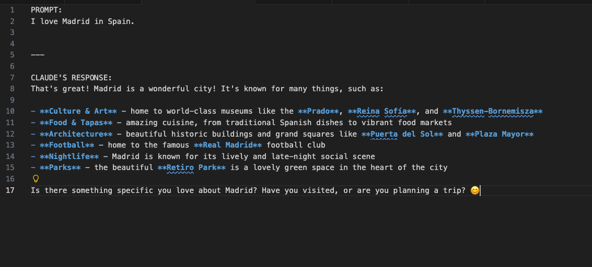

# Claude Prompt Reader

A VS Code extension that uses Claude's API to write a prompt, save the file, and Claude think through a response in the editor.

---

## How It Works

When you save a `.txt` or `.md` file in your `prompts/` folder, the extension detects the change, reads the file, and passes the contents to Claude. Claude doesn't just retrieve information — it reasons through what you wrote, applies deduction and contextual understanding, and generates a response that didn't exist before. That response comes back to your extension and opens in a new editor tab, right next to your code.
---

## Why It Exists

This project demonstrates the core pattern behind enterprise integration platforms like Workato, Boomi, and MuleSoft:

**Fetch → Transform → Load**

1. **Fetch** — read input from a source (your local file system via the VS Code workspace API)
2. **Transform** — pass it through an intelligent processing layer (Claude's reasoning engine via the Anthropic SDK)
3. **Load** — write the enriched output to a destination (a structured Markdown tab in your editor)

The file watcher adds **event-driven architecture** on top of that pipeline. The system listens for a save event and reacts automatically — the same model used in webhook-based automation workflows. No manual intervention required.

---

## How Claude's Reasoning Works Here

Claude is not a search engine. It doesn't look up answers. When your extension sends it a prompt, Claude draws on everything it was trained on to reason through your input and generate a response specific to what you asked.

Concretely, this means Claude can:

- **Summarize** complex text into plain English
- **Classify** input into categories without being given a predefined list
- **Deduce** intent from loosely written instructions and respond appropriately
- **Generate** structured output — lists, plans, analyses — from unstructured input
- **Answer questions** by applying contextual reasoning, not keyword matching

Every API call is stateless — Claude starts fresh each time with no memory of previous prompts. This makes the pipeline predictable and repeatable, which is exactly what you want in an automated workflow.

---

## Features

- **Auto-watch mode** — detects file saves in the `prompts/` folder and triggers the full pipeline automatically
- **Manual trigger** — run `Claude: Read Prompts` from the Command Palette at any time
- **Progress indicator** — a notification bar shows while Claude is reasoning through your prompt
- **Structured output** — responses open in a new Markdown tab showing both the original prompt and Claude's reply side by side
- **Secure API key storage** — your Anthropic API key is stored in VS Code settings, never hardcoded in source

---

## Tech Stack

- **TypeScript** — strict mode, Node16 module resolution
- **VS Code Extension API** — `createFileSystemWatcher`, `withProgress`, `openTextDocument`
- **Anthropic SDK** (`@anthropic-ai/sdk`) — `claude-sonnet-4-6` model
- **Node.js `fs` module** — file system reads

---

## Getting Started

### 1. Clone the repo

```bash
git clone https://github.com/kaidez/claude-prompt-reader.git
cd claude-prompt-reader
```

### 2. Install dependencies

```bash
npm install
```

### 3. Add your Anthropic API key

- Open VS Code Settings (`Cmd+,` on Mac, `Ctrl+,` on Windows)
- Search for **Claude Prompt Reader**
- Paste your Anthropic API key into the **Api Key** field

Don't have a key? Get one at [console.anthropic.com](https://console.anthropic.com).

### 4. Compile and run

```bash
npm run compile
```

Press `Fn+F5` (Mac) or `F5` (Windows) to launch the Extension Development Host.

### 5. Create a prompts folder

In whatever workspace you open in the dev host, create a `prompts/` subfolder and add a `.txt` or `.md` file with any prompt you want Claude to reason through.

---

## Usage

**Auto mode:** Save any `.txt` or `.md` file inside your `prompts/` folder. The extension detects the change and automatically sends it to Claude. A progress notification appears while Claude works, then a new tab opens with the response.

**Manual mode:** Open the Command Palette (`Cmd+Shift+P` on Mac, `Ctrl+Shift+P` on Windows) and run **Claude: Read Prompts**. The extension reads the first file it finds in your `prompts/` folder and sends it.

---

## Sample Output

When a prompt file is processed, a new Markdown tab opens with this structure:
## Extension in Action


```
PROMPT:
I have a job interview tomorrow for an integration engineering role.
Give me three questions I should be prepared to answer.

---

CLAUDE'S RESPONSE:
Here are three questions you should be prepared for:

1. Walk me through how you've designed an integration between two systems
   that had incompatible data formats. What was your approach?

2. How do you handle error recovery in an automated workflow when a
   downstream system is unavailable?

3. Describe a time when an integration you built failed in production.
   What happened, how did you diagnose it, and what did you change?
```

A plain file reader shows you your words back. Claude reasons through your prompt and gives you something you can actually use.

---

## Project Structure

```
claude-prompt-reader/
├── .vscode/
│   ├── extensions.json
│   ├── launch.json
│   └── tasks.json
├── out/                  # compiled JS output
├── prompts/              # drop your prompt files here
├── src/
│   └── extension.ts      # all extension logic
├── .gitignore
├── package.json
├── tsconfig.json
└── README.md
```

---

## What I'd Add Next

- **Save Selected Text command** — highlight any text in VS Code, right-click, save it directly to the `prompts/` folder
- **Multiple file processing** — iterate through all files in `prompts/` rather than just the first one
- **System prompt support** — add a configurable system prompt to shape how Claude responds across all requests
- **Webhook output** — POST the enriched response to an external endpoint in addition to opening a tab
- **Swap the data source** — replace the local file system with a GitHub Issues, Jira, or Zendesk feed to simulate a full enterprise integration pipeline

---

## Why This Architecture Matters

The pattern in this extension mirrors what enterprise integration engineers build every day. The file watcher is the trigger layer — equivalent to a webhook listener in Workato or a scheduled poller in Boomi. The Anthropic SDK call is the enrichment layer — equivalent to calling an external AI service to classify, summarize, or route business data. The output tab is the destination layer — equivalent to writing enriched records to a CRM, database, or downstream system.

Building this from scratch in TypeScript demonstrates an understanding of the architecture, not just the tooling.